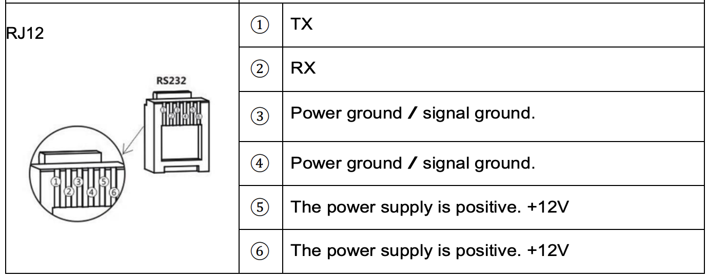

# Sunburst Solar Stats

Sunburst will be a simple application that retrieves selected solar data from the solar charge controller and provides it in a digestible way for the websites static content.

## R & D 

Reading key status details of the solar charge controller should be achievable with varying degrees of programming required based on device.

### Renogy Wanderer

See [Solar Charger Controller Modbus Protocol V1.0 <Renogy Official>](https://renogy-website.oss-us-east-1.aliyuncs.com/DeveloperPlatform/Solar_Charger_Controller_Modbus_Protocol_V1.0_EN.pdf)

Further Investigation:  
[Rover (Wanderer?) RS232 Port/DIY Cable](https://solarthing.readthedocs.io/en/latest/quickstart/serial-port/hardware/rover/rs232-port.html)  
[github.com/rosswarren/renogymodbus <python>](https://github.com/rosswarren/renogymodbus)  
[tokio-modbus <rust library>](https://github.com/slowtec/tokio-modbus)  

### Victron Devices

See [BlueSolar-HEX-protocol.pdf](https://www.victronenergy.com/upload/documents/BlueSolar-HEX-protocol.pdf) for VE.Direct Protocol details available on BlueSolar and SmartSolar MPPT chargers.

Required cable: [Victron Energy VE.Direct to USB](https://www.amazon.ca/Victron-Energy-ASS030530010-VE-Direct-Cable/dp/B01LZ6WTLW)  
[DIY Cable](https://diysolarforum.com/threads/cheap-victron-cable-diy-with-usb-isolation.87004/) using [DuPPa Isolated USB to TTL UART RS232](https://www.duppa.net/product-category/usb-uart-converters/)

Further Investigation:
[VE.Direct Protocol Parser <Rust>](https://github.com/Okm165/ve_direct)  
[VE.Direct Package <Go>](https://github.com/rosenstand/go-vedirect)  
[VE.Direct Library <Rust>](https://github.com/rosenstand/go-vedirect)  

